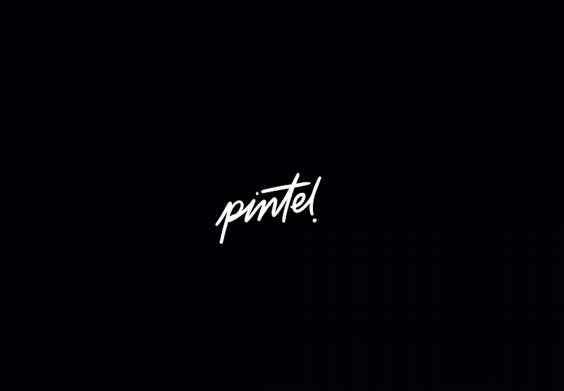

<h3>🎨 Play Drawing Games with AI Models 🤖</h3>

<strong>A fun, interactive game where you can draw, guess, and compete with artificial intelligence!</strong>

---

## 📖 About

**pintel** is an interactive AI drawing game where you compete with multiple AI models. It's a fun way to compare how different AI systems draw and guess without needing any technical knowledge.

- **Interactive Gameplay** - Draw, guess, and vote on AI-generated artwork
- **Multiple AI Models** - Play against GPT-4, Claude, Gemini, and Grok all at once
- **Competitive & Fun** - Challenge AI models or watch them compete against each other
- **Creative Freedom** - Use a full-featured drawing canvas with colors and tools
- **Track Performance** - See leaderboards showing which AI models are best at drawing and guessing
-  **Save Your Progress** - Create an account to save all your game sessions

Built for the **Vercel AI Gateway Hackathon** to showcase multi-model AI capabilities in a fun, engaging way.

---

## Features

### Four Fun Game Modes

<strong> Human Play - Draw and guess with AI friends</strong>

 

It's like a turn-based drawing game! Here's how it works:

- **Your turn to draw**: Get a secret prompt and draw it for 50 seconds while AI models try to guess
- **AI's turn to draw**: Watch as AI models draw prompts, and you have to guess what they're drawing
- **Hints appear**: Letters of the answer gradually reveal every 30 seconds to help you out
- **Real-time guessing**: See all the guesses come in live from AI models
- **Points & Scoring**: Get points when you guess correctly, or when your drawing is guessed first

Play 2 full rounds and see who wins! It's perfect for understanding how AI "thinks" when drawing and recognizing patterns.

<strong> Human Judge - Vote for the best AI artwork</strong>

 

You're the judge! Here's what to do:

- **Pick your AI squad**: Choose 2-8 AI models you want to compete
- **Get a prompt**: You'll see a random drawing prompt (like "a robot cooking spaghetti")
- **Watch them draw**: All selected models generate drawings at the same time
- **Vote anonymously**: See the drawings shuffled and vote for your favorite without knowing which AI created it
- **Results revealed**: After voting, find out which AI model created each drawing
- **Leaderboard**: Track which AI models win the most votes over multiple rounds

It's like "Project Runway" but for AI! Perfect for discovering which models have the best artistic style.

<strong> Model Guess - Challenge AI to guess your drawing</strong>

 

The AI becomes the guesser! Here's how:

- **You draw**: Get a random prompt and draw whatever you'd like for your chosen AI models
- **AI tries to guess**: Watch as 2-6 AI models analyze your drawing and take guesses
- **Real-time responses**: See guesses appear in real-time as AI models recognize what you drew
- **First correct wins**: The first model to guess correctly gets the point
- **Fuzzy matching**: The AI is smart about variations (like "drawing" vs "drew" both count)
- **Leaderboard**: See which AI models are best at recognizing your drawings

Test how well AI can understand your artistic skills! Sometimes they're spot-on, sometimes hilariously wrong.

<strong> AI Duel - Watch AI models compete</strong>

 

Sit back and watch AI models battle it out! Here's what happens:

- **Build your bracket**: Select 3-6 AI models to compete
- **Automated competition**: AI models take turns drawing and guessing automatically
- **Points system**:
  - 3 points for first correct guess
  - 1 point for other correct guesses
  - 1 point for the drawer if nobody guesses
- **8 full rounds** of competition
- **Watch with controls**: Play at normal speed, fast-forward, or jump straight to results
- **Pause anytime**: Stop to look at drawings more closely
- **Live leaderboard**: Watch scores update in real-time

Perfect for comparing AI models head-to-head in a fun tournament format!

---

 

**Made with ❤️ for the Vercel AI Gateway Hackathon**

<strong>Have fun playing with AI and discovering how different models think!</strong>

